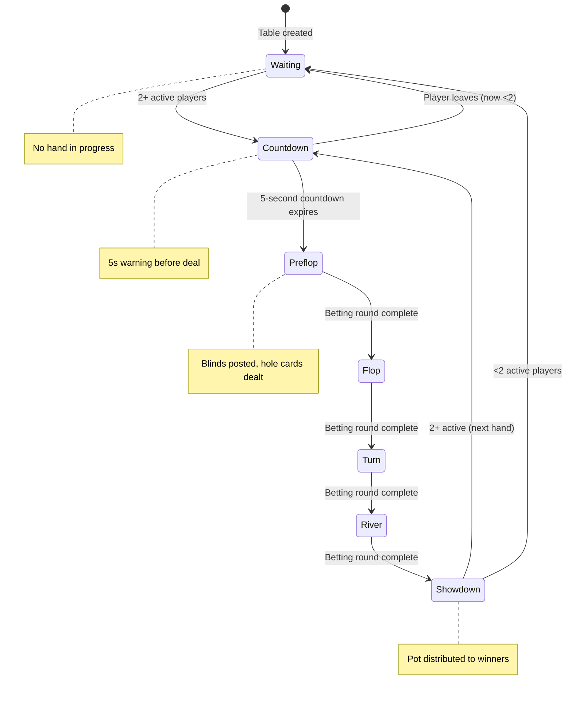

# Table Lifecycle Documentation

> **Architectural Decision**: Hands start **automatically** when 2+ players are seated and marked as "active".  
> This prevents "Griefing by Inaction" where one player stalls the entire table.

---

## State Machine



---

## Auto-Start Conditions

A new hand begins automatically when ALL of the following are true:

| Condition | Description |
|-----------|-------------|
| **Player Count** | At least 2 players have `status: 'active'` |
| **Countdown** | 5-second countdown has completed without interruption |
| **Pot Cleared** | Previous hand's pot has been fully distributed |
| **Blinds Posted** | SB and BB have sufficient chips to post |

---

## Phase Transitions

| Current Phase | Trigger | Next Phase | Lua Script | Actions |
|---------------|---------|------------|------------|---------|
| `waiting` | 2nd player marks active | `countdown` | - | Start 5s timer |
| `countdown` | Timer expires | `preflop` | `start_hand.lua` | Rotate dealer, post blinds, shuffle deck, deal hole cards |
| `countdown` | Player count drops <2 | `waiting` | - | Cancel timer |
| `preflop` | Betting complete | `flop` | `next_phase.lua` | Reveal 3 community cards |
| `flop` | Betting complete | `turn` | `next_phase.lua` | Reveal 4th community card |
| `turn` | Betting complete | `river` | `next_phase.lua` | Reveal 5th community card |
| `river` | Betting complete | `showdown` | `showdown.lua` | Evaluate hands, distribute pot |
| `showdown` | Pot distributed | `countdown` or `waiting` | - | Check player count, start new hand or wait |

---

## Dealer Button Rotation

The `dealerSeat` rotates **clockwise** automatically via `start_hand.lua`:

```lua
-- Pseudocode in start_hand.lua
local currentDealer = tonumber(redis.call('HGET', tableKey, 'dealerSeat'))
local nextDealer = (currentDealer % maxSeats) + 1

-- Skip empty seats
while not playerExists(nextDealer) do
    nextDealer = (nextDealer % maxSeats) + 1
end

redis.call('HSET', tableKey, 'dealerSeat', nextDealer)
```

---

## Blind Posting

| Position | Offset from Dealer | Action |
|----------|-------------------|--------|
| **Small Blind** | +1 seat (clockwise) | Posts `smallBlind` amount |
| **Big Blind** | +2 seats (clockwise) | Posts `bigBlind` amount |

If a player cannot cover their blind:
- They are marked `all-in` immediately
- Remaining blind deficit creates side pot logic

---

## Redis Keys Modified Per Phase

| Lua Script | Keys READ | Keys MODIFIED |
|------------|-----------|---------------|
| `start_hand.lua` | `table:{id}:players` | `table:{id}`, `table:{id}:deck`, `table:{id}:players` |
| `bet.lua` | `table:{id}`, `table:{id}:players` | `table:{id}`, `table:{id}:players` |
| `fold.lua` | `table:{id}:players` | `table:{id}:players`, `table:{id}` (turn) |
| `next_phase.lua` | `table:{id}:deck` | `table:{id}` (phase, communityCards) |
| `showdown.lua` | `table:{id}`, `table:{id}:players` | `table:{id}:players` (chips) |

---

## Socket Events Emitted

| Event | Direction | Trigger | Payload |
|-------|-----------|---------|---------|
| `table_state` | Server → Client | Any state change | Full `TableSnapshot` |
| `countdown` | Server → Client | Hand about to start | `{ seconds: 5 }` |
| `your_turn` | Server → Client | Turn changed to player | `{ timeoutMs: 30000 }` |
| `hand_result` | Server → Client | Showdown complete | `{ winners: [...], pot: number }` |
